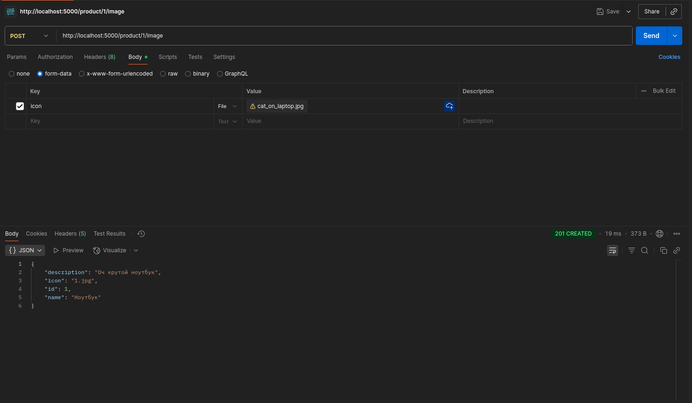
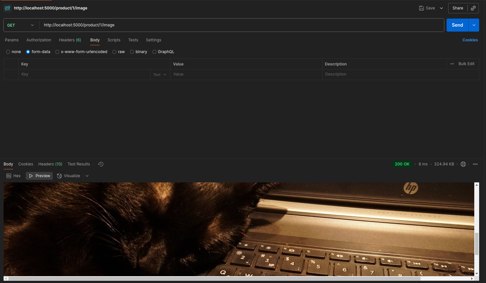

# Практика 2. Rest Service

## Программирование. Rest Service. Часть I

### Задание А (3 балла)
Создайте простой REST сервис, в котором используются HTTP операции GET, POST, PUT и DELETE.
Предположим, что это сервис для будущего интернет-магазина, который пока что умеет 
работать только со списком продуктов. У каждого продукта есть поля: `id` (уникальный идентификатор),
`name` и `description`. 

Таким образом, json-схема продукта (обозначим её `<product-json>`):

```json
{
  "id": 0,
  "name": "string",
  "description": "string"
}
```

Данные продукта от клиента к серверу должны слаться в теле запроса в виде json-а, **не** в параметрах запроса.

Ваш сервис должен поддерживать следующие операции:
1. Добавить новый продукт. При этом его `id` должен сгенерироваться автоматически
   - `POST /product`
   - Схема запроса:
     ```json
     {
       "name": "string",
       "description": "string"
     }
     ```
   - Схема ответа: `<product-json>` (созданный продукт)
2. Получить продукт по его id
   - `GET /product/{product_id}`
   - Схема ответа: `<product-json>`
3. Обновить существующий продукт (обновляются только те поля продукта, которые были переданы в теле запроса)
   - `PUT /product/{product_id}`
   - Схема запроса: `<product-json>` (некоторые поля могут быть опущены)
   - Схема ответа: `<product-json>` (обновлённый продукт)
4. Удалить продукт по его id
   - `DELETE /product/{product_id}`
   - Схема ответа: `<product-json>` (удалённый продукт)
5. Получить список всех продуктов 
   - `GET /products`  
   - Схема ответа:
     ```
     [ 
       <product-json-1>,
       <product-json-2>, 
       ... 
     ]
     ```

Предусмотрите возвращение ошибок (например, если запрашиваемого продукта не существует).

Вы можете положить код сервиса в отдельную директорию рядом с этим документом.

### Задание Б (3 балла)
Продемонстрируйте работоспособность сервиса с помощью программы Postman
(https://www.postman.com/downloads) и приложите соответствующие скрины, на которых указаны
запросы и ответы со стороны сервиса для **всех** его операций.

#### Демонстрация работы


### Задание В (4 балла)
Пусть ваш продукт также имеет иконку (небольшую картинку). Формат иконки (картинки) может
быть любым на ваш выбор. Для простоты будем считать, что у каждого продукта картинка одна.

Добавьте две новые операции:
1. Загрузить иконку:
   - `POST product/{product_id}/image`
   - Запрос содержит бинарный файл — изображение  
     
2. Получить иконку:
   - `GET product/{product_id}/image`
   - В ответе передаётся только сама иконка  
     

Измените операции в Задании А так, чтобы теперь схема продукта содержала сведения о загруженной иконке, например, имя файла или путь:
```json
"icon": "string"
```

#### Демонстрация работы



---

_(*) В последующих домашних заданиях вам будет предложено расширить функционал данного сервиса._

## Задачи

### Задача 1 (2 балла)
Общая (сквозная) задержка прохождения для одного пакета от источника к приемнику по пути,
состоящему из $N$ соединений, имеющих каждый скорость $R$ (то есть между источником и
приемником $N - 1$ маршрутизатор), равна $d_{\text{сквозная}} = N \dfrac{L}{R}$
Обобщите данную формулу для случая пересылки количества пакетов, равного $P$.

#### Решение
Первый пакет идёт через все $N$ соединений, что занимает $N \dfrac{L}{R}$ времени. Каждые следующие $P−1$ пакетов "выезжают" из системы по одному с интервалом $\dfrac{L}{R}$, что занимает $(P-1) \dfrac{L}{R}$. <br>
Итого имеем: $d_{\text{сквозная}}^{\text{(для }P\text{ пакетов)}} = N \dfrac{L}{R} + (P-1) \dfrac{L}{R} = (N+P-1) \dfrac{L}{R}$

### Задача 2 (2 балла)
Допустим, мы хотим коммутацией пакетов отправить файл с хоста A на хост Б. Между хостами установлены три
последовательных канала соединения со следующими скоростями передачи данных:
$R_1 = 200$ Кбит/с, $R_2 = 3$ Мбит/с и $R_3 = 2$ Мбит/с.
Сколько времени приблизительно займет передача на хост Б файла размером $5$ мегабайт?
Как это время зависит от размера пакета?

#### Решение
Пусть $F := 5\ Мбайт = 40 \cdot 10^6\ бит$. <br>
Первый пакет пройдёт по всем трём каналам последовательно, что займёт $\dfrac{L}{R_1} + \dfrac{L}{R_2} + \dfrac{L}{R_3}$ времени. Каждый следующий пакет отправляется ровно тогда, когда освобождается самый медленный канал: в данном случае — $1$-ый канал. Значит, пока какой-либо пакет движется по каналам $2$ и $3$, канал $1$ уже свободен и готов принять следующий пакет. Получаем, что интервал между двумя подряд идущими стартами пакетов ограничен только временем передачи одного пакета по $1$-ому каналу, т.е. время передачи каждого из оставшихся пакетов равно $\dfrac{L}{R_1}$. Всего пакетов: $\dfrac{F}{L}$. <br>
Итого суммарное время передачи равно $\dfrac{L}{R_1} + \dfrac{L}{R_2} + \dfrac{L}{R_3} + (\dfrac{F}{L} - 1) \dfrac{L}{R_1} = \dfrac{F}{R_1} + \dfrac{L}{R_2} + \dfrac{L}{R_3} = \dfrac{40 \cdot 10^6}{200 \cdot 10^3} + \dfrac{L}{3 \cdot 10^6} + \dfrac{L}{2 \cdot 10^6} = 200 + L (\dfrac{1}{3 \cdot 10^6} + \dfrac{1}{2 \cdot 10^6})$ секунд. <br>
Как видим, зависимость времени передачи от размера пакета — линейная, но с очень маленькой константой. Поэтому даже если $L \geq F$, то время передачи будет равно $200 + 40 \cdot 10^6 \cdot (\dfrac{1}{3 \cdot 10^6} + \dfrac{1}{2 \cdot 10^6}) \approx 233,33$ секунд, и даже в этом случае мы видим, что вклад от медленного канала ($200$ секунд) всё ещё в несколько раз превышает вклад от размера пакета. Поэтому можно сказать, что время ***довольно слабо*** зависит от размера пакета. 

### Задача 3 (2 балла)
Предположим, что пользователи делят канал с пропускной способностью $2$ Мбит/с. Каждому
пользователю для передачи данных необходима скорость $100$ Кбит/с, но передает он данные
только в течение $20$ процентов времени использования канала. Предположим, что в сети всего $60$
пользователей. А также предполагается, что используется сеть с коммутацией пакетов. Найдите
вероятность одновременной передачи данных $12$ или более пользователями.

#### Решение
Пусть $X$ — число одновременно передающих пользователей. Поскольку каждый из $n := 60$ пользователей с вероятностью $p := 0.2$ передаёт в данный момент (и независимо друг от друга), имеем $X \sim Bin(n=60, p = 0.2)$. Хотим посчитать вероятность $P(X \geq 12) = 1 - P(X \leq 11) = 1 - \sum_{k=0}^{11} \binom{60}{k} 0.2^k 0.8^{60-k} \approx 0.551383$.

### Задача 4 (2 балла)
Пусть файл размером $X$ бит отправляется с хоста А на хост Б, между которыми три линии связи и
два коммутатора. Хост А разбивает файл на сегменты по $S$ бит каждый и добавляет к ним
заголовки размером $80$ бит, формируя тем самым пакеты длиной $L = 80 + S$ бит. Скорость
передачи данных по каждой линии составляет $R$ бит/с. Загрузка линий мала, и очередей пакетов
нет. При каком значении $S$ задержка передачи файла между хостами А и Б будет минимальной?
Задержкой распространения сигнала пренебречь.

#### Решение
Всего пакетов: $P := \dfrac{X}{S}$. Подставляя $N = 3$, $P = \dfrac{X}{S}$ и $L = S + 80$ в формулу, полученную в решении задания 1, имеем время передачи, равное $(\dfrac{X}{S} + 2) \dfrac{S + 80}{R}$. Пренебрегая константным множителем $\dfrac{1}{R}$, минимизируем $(\dfrac{X}{S} + 2) (S + 80) = \dfrac{X}{S} S + \dfrac{X}{S} \cdot 80 + 2S + 160 = X + \dfrac{80X}{S} + 2S + 160$. Берём производную по $S$: $-\dfrac{80X}{S^2} + 2$. Приравниваем её к нулю: $-\dfrac{80X}{S^2} + 2 = 0 \Longrightarrow S^2 = 40X \Longrightarrow S = \sqrt{40X}$. Вторая производная $\dfrac{160X}{S^3} > 0$, значит это действительно минимум. <br>
Ответ: $\sqrt{40X}$ бит.  

### Задание 5 (2 балла)
Рассмотрим задержку ожидания в буфере маршрутизатора. Обозначим через $I$ интенсивность
трафика, то есть $I = \dfrac{L a}{R}$.
Предположим, что для $I < 1$ задержка ожидания вычисляется как $\dfrac{I \cdot L}{R (1 – I)}$. 
1. Напишите формулу для общей задержки, то есть суммы задержек ожидания и передачи.
2. Опишите зависимость величины общей задержки от значения $\dfrac{L}{R}$.

#### Решение
1. Задержка передачи равна просто $\dfrac{L}{R}$, <br>
поэтому общая задержка вычисляется, как $\dfrac{L}{R} + \dfrac{I \cdot L}{R (1 – I)} = \dfrac{L}{R} (1 + \dfrac{I}{1 - I}) = \dfrac{L}{R} \dfrac{1 - I + I}{1 - I} = \dfrac{L}{R (1 - I)}$.
2. $x := \dfrac{L}{R} \Longrightarrow I = ax$. При $I < 1$ имеем $0 \leq x < \dfrac{1}{a}$. Первая производная по $x$ равна $\dfrac{1}{(1 - ax)^2} > 0 \Longrightarrow$ задержка монотонно возрастает при увеличении $x$. При этом вторая производная равна $\dfrac{2a}{(1 - ax)^3} > 0 \Longrightarrow$ задержка возрастает тем сильнее, чем ближе $x$ к $\dfrac{1}{a}$. При $x \rightarrow 0$ имеем $1 - ax \approx 1 \Longrightarrow$ задержка $\approx x$. При $x \rightarrow \dfrac{1}{a}^-$ задержка стремится к бесконечности. <br>
Какие выводы из всего этого можно сделать: пока либо размер пакета маленький, либо канал быстрый (иными словами, $\dfrac{L}{R} \ll \dfrac{1}{a}$) пакет передаётся почти сразу — задержка почти равна чистому времени передачи (пропорциональна $\dfrac{L}{R}$). Но если линия загружена почти на 100% ($\dfrac{L}{R} \approx \dfrac{1}{a}$), любое дальнейшее увеличение $\dfrac{L}{R}$ вызовет очень бурный рост ожидания. <br>
Итого имеем линейную зависимость при маленьких $\dfrac{L}{R}$ и резкое стремление к бесконечности по гиперболе, когда $\dfrac{L}{R}$ приближается к $\dfrac{1}{a}$.