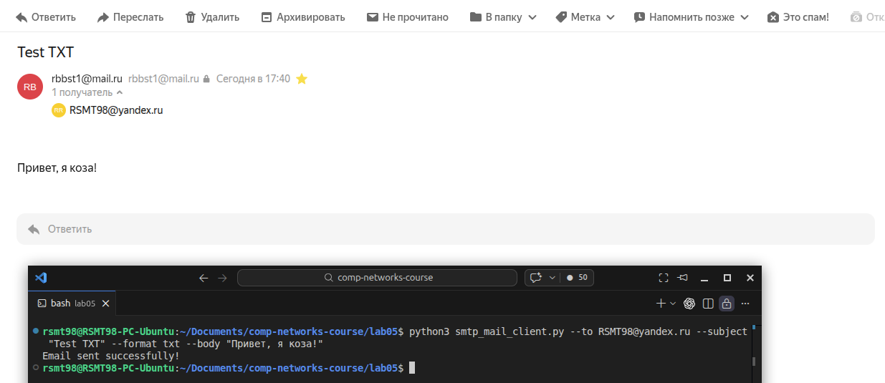
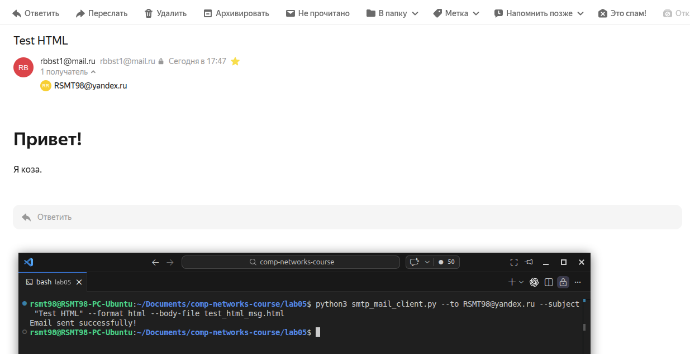
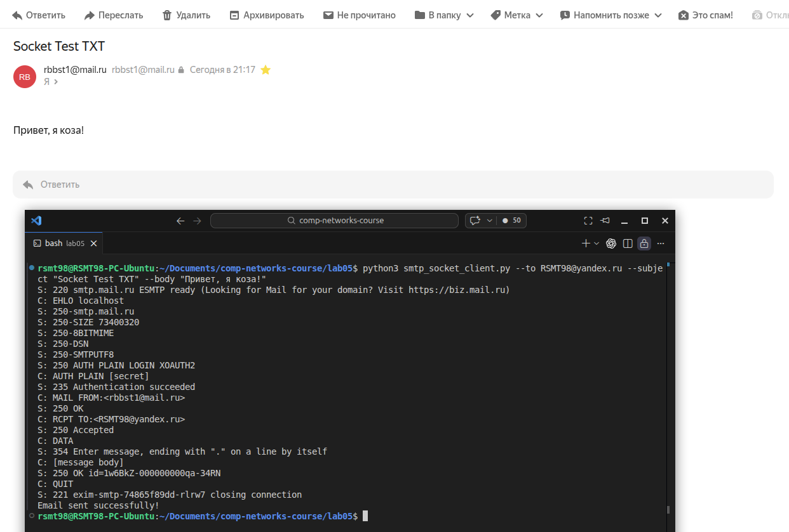
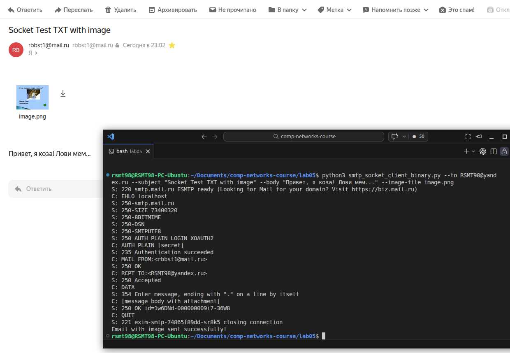
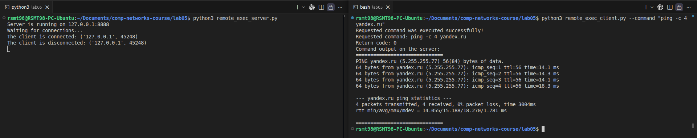
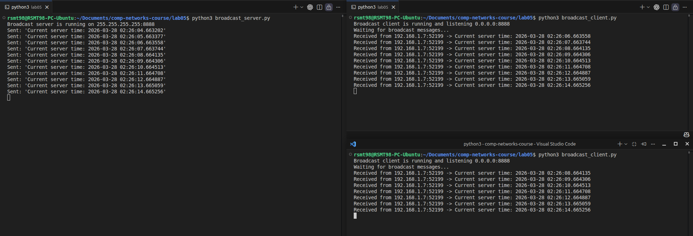
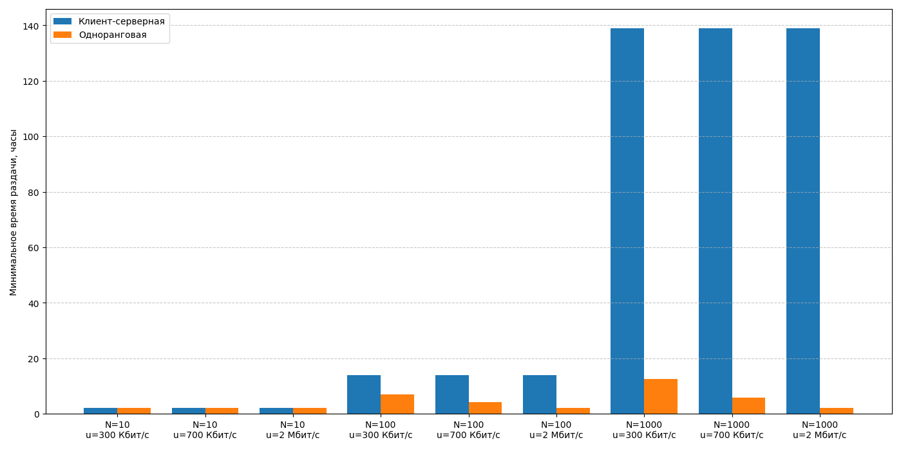

# Практика 5. Прикладной уровень

## Программирование сокетов.

### A. Почта и SMTP (7 баллов)

### 1. Почтовый клиент (2 балла)
Напишите программу для отправки электронной почты получателю, адрес
которого задается параметром. Адрес отправителя может быть постоянным. Программа
должна поддерживать два формата сообщений: **txt** и **html**. Используйте готовые
библиотеки для работы с почтой, т.е. в этом задании **не** предполагается общение с smtp
сервером через сокеты напрямую.

Приложите скриншоты полученных сообщений (для обоих форматов).

#### Демонстрация работы

### 2. SMTP-клиент (3 балла)
Разработайте простой почтовый клиент, который отправляет текстовые сообщения
электронной почты произвольному получателю. Программа должна соединиться с
почтовым сервером, используя протокол SMTP, и передать ему сообщение.
Не используйте встроенные методы для отправки почты, которые есть в большинстве
современных платформ. Вместо этого реализуйте свое решение на сокетах с передачей
сообщений почтовому серверу.

Сделайте скриншоты полученных сообщений.

#### Демонстрация работы

### 3. SMTP-клиент: бинарные данные (2 балла)
Модифицируйте ваш SMTP-клиент из предыдущего задания так, чтобы теперь он мог
отправлять письма с изображениями (бинарными данными).

Сделайте скриншот, подтверждающий получение почтового сообщения с картинкой.

#### Демонстрация работы

---

_Многие почтовые серверы используют ssl, что может вызвать трудности при работе с ними из
ваших приложений. Можете использовать для тестов smtp сервер СПбГУ: mail.spbu.ru, 25_

### Б. Удаленный запуск команд (3 балла)
Напишите программу для запуска команд (или приложений) на удаленном хосте с помощью TCP сокетов.

Например, вы можете с клиента дать команду серверу запустить приложение Калькулятор или
Paint (на стороне сервера). Или запустить консольное приложение/утилиту с указанными
параметрами. Однако запущенное приложение **должно** выводить какую-либо информацию на
консоль или передавать свой статус после запуска, который должен быть отправлен обратно
клиенту. Продемонстрируйте работу вашей программы, приложив скриншот.

Например, удаленно запускается команда `ping yandex.ru`. Результат этой команды (запущенной на
сервере) отправляется обратно клиенту.

#### Демонстрация работы

### В. Широковещательная рассылка через UDP (2 балла)
Реализуйте сервер (веб-службу) и клиента с использованием интерфейса Socket API, которая:
- работает по протоколу UDP
- каждую секунду рассылает широковещательно всем клиентам свое текущее время
- клиент службы выводит на консоль сообщаемое ему время

#### Демонстрация работы

## Задачи

### Задача 1 (2 балла)
Рассмотрим короткую, $10$-метровую линию связи, по которой отправитель может передавать
данные со скоростью $150$ бит/с в обоих направлениях. Предположим, что пакеты, содержащие
данные, имеют размер $100000$ бит, а пакеты, содержащие только управляющую информацию
(например, флаг подтверждения или информацию рукопожатия) – $200$ бит. Предположим, что у
нас $10$ параллельных соединений, и каждому предоставлено $1/10$ полосы пропускания канала
связи. Также допустим, что используется протокол HTTP, и предположим, что каждый
загруженный объект имеет размер $100$ Кбит, и что исходный объект содержит $10$ ссылок на другие
объекты того же отправителя. Будем считать, что скорость распространения сигнала равна
скорости света ($300 \cdot 10^6$ м/с).
1. Вычислите общее время, необходимое для получения всех объектов при параллельных
непостоянных HTTP-соединениях
2. Вычислите общее время для постоянных HTTP-соединений. Ожидается ли существенное
преимущество по сравнению со случаем непостоянного соединения?

#### Решение
Задержка распространения (в одну сторону):
$$
t_{prop} = \frac{длина\ линии}{скорость\ распространения} = \frac{10}{300 \cdot 10^6} \approx 3.33 \cdot 10^{-8}\text{ с}
$$
Время передачи управляющего пакета при скорости 150 бит/с:
$$
t_c = \frac{размер\ управляющего\ пакета}{пропускная\ способность\ линии} = \frac{200}{150} \approx 1.3333\text{ с}
$$
Время передачи пакета данных при скорости 150 бит/с:
$$
t_d = \frac{размер\ пакета\ данных}{пропускная\ способность\ линии} = \frac{100000}{150} \approx 666.6666\text{ с}
$$
Время передачи управляющего пакета при скорости 15 бит/с (когда 10 соединений делят канал поровну):
$$
t_c^{(10)} = \frac{200}{15} \approx 13.3333\text{ с}
$$
Время передачи пакета данных при скорости 15 бит/с:
$$
t_d^{(10)} = \frac{100000}{15} \approx 6666.6666\text{ с}
$$
###### 1. Параллельные непостоянные HTTP-соединения
Для непостоянного соединения перед передачей объекта идут:
1) SYN
2) SYN+ACK
3) ACK
4) HTTP GET
5) пакет данных с объектом

Т.е. на один объект по новому соединению требуется:
- 4 управляющих пакета
- 1 пакет данных

Для основного объекта (не для объектов по ссылкам) используется одно соединение, значит можно занять всю пропускную способность линии. Тогда время передачи основного объекта равно:
$$
T_{base} = 4t_c + t_d + 5t_{delay} \approx 4 \cdot 1.3333 + 666.6666 \approx 672\text{ с}
$$
Далее идут 10 параллельных непостоянных соединений и каждое получает только $15$ бит/с. Тогда время передачи одного встроенного объекта:
$$
T_{obj}^{(np)} = 4t_c^{(10)} + t_d^{(10)} + 5t_{delay} \approx 4 \cdot 13.3333 + 6666.6666 = 6720\text{ с}
$$
Т.к. все 10 объектов загружаются параллельно, значит и общее время передачи всех встроенных объектов равно:
$$
T_{emb}^{(np)} = T_{obj}^{(np)} = 6720\text{ с}
$$
Итого, общее время равно:
$$
\boxed{T_{np} = T_{base} + T_{emb}^{(np)} = 672 + 6720 = 7392\text{ с} = 123.2\text{ мин} = 2\text{ ч }3\text{ мин }12\text{ с}}
$$
###### 2. Постоянное HTTP-соединение
При постоянном соединении для получения основного объекта всё так же нужно установить TCP-соединение, сделать HTTP GET и передать данные, так что время передачи основного объекта будет такое же, как и в первом пункте.  
Но вот уже для каждого следующего объекта TCP-рукопожатие не нужно, и остаётся только:
1) HTTP GET
2) передача объекта

Получаем, что время передачи одного встроенного объекта равно:
$$
T_{obj}^{(p)} = t_c + t_d + 2t_{delay} \approx 1.3333 + 666.6666 = 668\text{ с}
$$
А для всех 10 объектов:
$$
T_{emb}^{(p)} = 10 \cdot T_{obj}^{(p)} = 10 \cdot 668 = 6680\text{ с}
$$
Итого, общее время равно:
$$
\boxed{T_p = T_{base} + T_{emb}^{(p)} = 672 + 6680 = 7352\text{ с} \approx 122.53\text{ мин} \approx 2\text{ ч }2\text{ мин }32\text{ с}}
$$
Разница со случаем непостоянного соединения составляет всего:
$$
T_{np} - T_p = 7392 - 7352 = 40\text{ с}
$$
а относительная разница:
$$
\frac{T_{np} - T_p}{T_{np}} = \frac{40}{7392} \approx 0.54\%
$$
Так что **нет**, существенного преимущества нет, ибо почти всё время тратится на передачу самих относительно больших объектов по относительно очень медленному каналу, а не на TCP-рукопожатия и HTTP-запросы.

### Задача 2 (3 балла)
Рассмотрим раздачу файла размером $F = 15$ Гбит $N$ пирам. Сервер имеет скорость отдачи $u_s = 30$
Мбит/с, а каждый узел имеет скорость загрузки $d_i = 2$ Мбит/с и скорость отдачи $u$. Для $N = 10$, $100$
и $1000$ и для $u = 300$ Кбит/с, $700$ Кбит/с и $2$ Мбит/с подготовьте график минимального времени
раздачи для всех сочетаний $N$ и $u$ для вариантов клиент-серверной и одноранговой раздачи.

#### Решение

### Задача 3 (3 балла)
Рассмотрим клиент-серверную раздачу файла размером $F$ бит $N$ пирам, при которой сервер
способен отдавать одновременно данные множеству пиров – каждому с различной скоростью,
но общая скорость отдачи при этом не превышает значения $u_s$. Схема раздачи непрерывная.
1. Предположим, что $\dfrac{u_s}{N} \le d_{min}$.
   При какой схеме общее время раздачи будет составлять $\dfrac{N F}{u_s}$?
2. Предположим, что $\dfrac{u_s}{N} \ge d_{min}$. 
   При какой схеме общее время раздачи будет составлять  $\dfrac{F}{d_{min}}$?
3. Докажите, что минимальное время раздачи описывается формулой $\max\left(\dfrac{N F}{u_s}, \dfrac{F}{d_{min}}\right)$?

#### Решение
Пусть $v_i$ — скорость, с которой сервер передаёт данные пиру $i$. Тогда, чтобы схема была допустима, должно выполняться
$$
\sum_{i=1}^N v_i\le u_s
$$
###### 1. Случай $\dfrac{u_s}{N} \le d_{\min}$
Тут подойдёт схема, в которой мы раздаём файл всем $N$ пирам одновременно и равномерно с постоянной скоростью
$$
v_i=\frac{u_s}{N}, \qquad i=1,\dots,N
$$
Такая схема допустима, ибо суммарная скорость сервера равна
$$
\sum_{i=1}^N v_i=N\cdot \frac{u_s}{N}=u_s
$$
При такой схеме общее время раздачи равно
$$
\boxed{T=\frac{F}{u_s/N}=\frac{NF}{u_s}}
$$
###### 2. Случай $\dfrac{u_s}{N} \ge d_{\min}$
Тут предлагается передавать каждому пиру одновременно с постоянной скоростью
$$
v_i=d_{\min}, \qquad i=1,\dots,N
$$
Такая схема допустима, ибо суммарная скорость сервера равна
$$
\sum_{i=1}^N v_i = Nd_{\min}\le u_s, \qquad \text{т.к. по условию} \qquad \frac{u_s}{N}\ge d_{\min}\iff u_s\ge Nd_{\min}
$$
При такой схеме общее время раздачи равно
$$
\boxed{T=\frac{F}{d_{\min}}}
$$
###### 3. Доказательство формулы
Сервер должен передать суммарно $N$ копий файла, то есть всего $NF$ бит данных.  
Но сервер не может передавать быстрее, чем $u_s$ бит/с, поэтому за время $T$ он может передать не более $u_s T$ бит.  
Значит должно выполняться
$$
u_s T \ge NF,
$$
а значит
$$
\boxed{T\ge \frac{NF}{u_s}}
$$
Теперь рассмотрим пира с минимальной скоростью загрузки $d_{\min}$. Он должен получить $F$ бит, а быстрее чем со скоростью $d_{\min}$ принимать не может.  
Следовательно,
$$
\boxed{T\ge \frac{F}{d_{\min}}}
$$
Обе оценки должны выполняться одновременно, значит для любой схемы раздачи
$$
\boxed{T\ge \max\left(\frac{NF}{u_s},\frac{F}{d_{\min}}\right)}
$$
Теперь покажем, что эта нижняя граница достигается.  
При $\dfrac{NF}{u_s} \ge \dfrac{F}{d_{\min}}$ имеем $\dfrac{u_s}{N}\le d_{\min},$ а по пункту 1 мы уже знаем схему, которая даёт время
$$
T=\frac{NF}{u_s}=
\max\left(\frac{NF}{u_s},\frac{F}{d_{\min}}\right)
$$
При $\dfrac{F}{d_{\min}} \ge \dfrac{NF}{u_s}$ имеем $\dfrac{u_s}{N}\ge d_{\min},$ а по пункту 2 мы уже знаем схему, которая даёт время
$$
T=\frac{F}{d_{\min}}=
\max\left(\frac{NF}{u_s},\frac{F}{d_{\min}}\right)
$$
Значит, минимальное время раздачи действительно описывается формулой
$$
\boxed{\max\left(\frac{NF}{u_s},\frac{F}{d_{\min}}\right)}
$$
