# Практика 7. Транспортный уровень

## Wireshark: TCP (5 баллов)

### Перехват TCP-передачи данных от вашего компьютера удаленному серверу
При ответе на вопросы прикладывайте соответствующие скрины программы Wireshark.

#### Подготовка
1. Откройте веб-браузер и перейдите по ссылке gaia.cs.umass.edu/wireshark-labs/alice.txt.
   Здесь вы найдете копию книги «Алиса в стране чудес» в формате ASCII. Сохраните этот файл 
   на свой компьютер.
2. Перейдите по ссылке: gaia.cs.umass.edu/wireshark-labs/TCP-wireshark-file1.html. Сюда вы
   будете загружать ранее сохраненный файл.
3. Запустите Wireshark и начните перехват пакетов.
4. Теперь загрузите текстовый файл «Алиса в стране чудес» на указанной в п.2 страничке.
5. Остановите захват пакетов в приложении Wireshark. Используйте фильтр пакетов tcp.

#### Вопросы
1. Какой IP-адрес и номер порта TCP использует ваш компьютер (отправитель), передающий
   файл серверу gaia.cs.umass.edu? Для ответа на вопрос, возможно, проще выбрать http-сообщение
   и рассмотреть информацию TCP-пакета, используемого для передачи этого http-сообщения, 
   в окне деталей заголовка пакета.
   - 192.168.1.7:35370  
   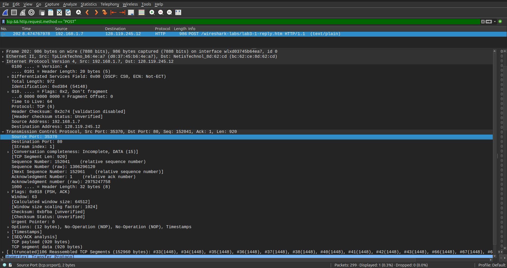
2. Каков IP-адрес у сервера gaia.cs.umass.edu? Каковы номера портов для отправки и приема
   TCP-сегментов этого соединения?
   - IP сервера: 128.119.245.12 (видно на прошлом скриншоте)
   - Номера портов (также видно на прошлом скриншоте):
     - порт отправителя (клиента): 35370
     - порт получателя (сервера): 80
3. Какой порядковый номер у SYN TCP-сегмента, который используется для установления
   TCP-соединения между компьютером клиента и сервером gaia.cs.umass.edu? Как
   определяется, что это именно SYN-сегмент?
   - Порядковый номер равен `0`.  
   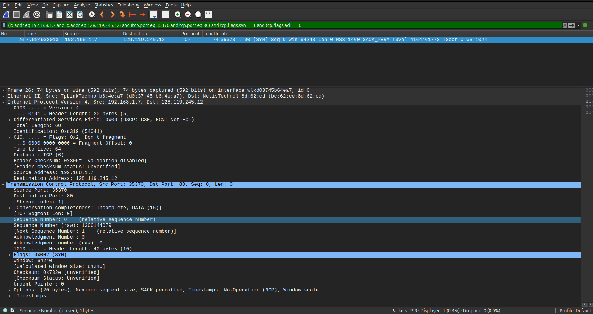
   - То, что это именно SYN-сегмент, можно определить по тому, что в поле Flags выставлен только флаг SYN, а флаг ACK не установлен.
4. Какой порядковый номер у SYNACK-сегмента, отправленного сервером gaia.cs.umass.edu
   на компьютер клиента в ответ на SYN-сегмент? Какое значение хранится в поле
   подтверждения в SYNACK-сегменте? Как сервер gaia.cs.umass.edu определил это значение?
   Как определяется, что это именно SYNACK-сегмент?
   - Порядковый номер равен `0`.  
   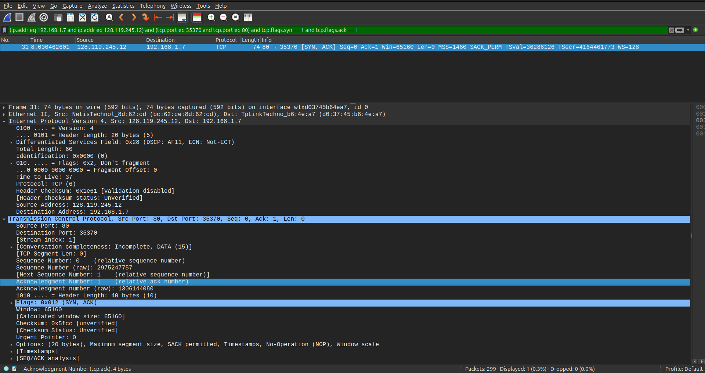
   - Значение поля подтверждения ACK равно `1`.
   - Сервер определил это значение как `порядковый номер SYN-сегмента клиента + 1`.
   - То, что это именно SYNACK-сегмент, можно определить по тому, что в поле Flags выставлены флаги SYN и ACK.
5. Какой порядковый номер у TCP-сегмента, содержащего команду POST протокола HTTP?
   (для нахождения команды POST вам потребуется проникнуть внутрь поля содержимого
   пакета в нижней части окна Wireshark, чтобы найти сегмент, в поле DATA которого
   хранится значение POST)
   - Порядковый номер равен `1`.  
   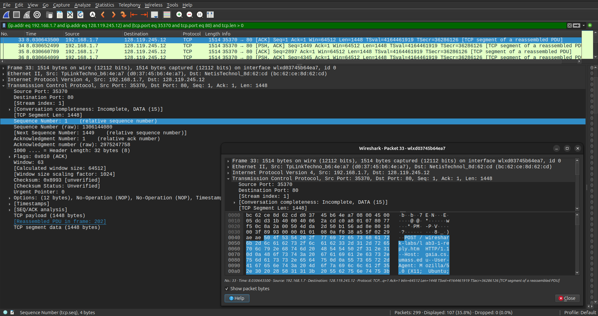
6. Рассмотрите TCP-сегмент, содержащий команду POST протокола HTTP, как первый TCP-сегмент 
   соединения. Какие порядковые номера у первых шести сегментов TCP-соединения 
   (включая сегмент, содержащий команду POST протокола HTTP)? Когда был
   отправлен каждый сегмент? Когда был получен ACK-пакет для каждого сегмента?
   Покажите разницу между тем, когда каждый TCP-сегмент был отправлен и когда было
   получено каждое подтверждение, чему равно значение RTT для каждого из 6 сегментов?
   - Порядковые номера равны `1`, `1449`, `2897`, `4345`, `5793` и `7241`.  
   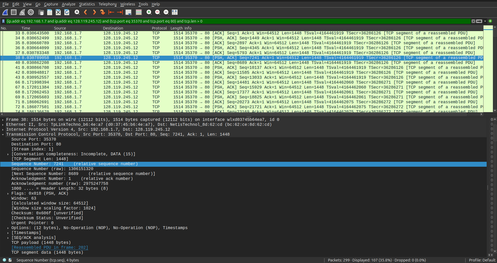
   - Время отправки каждого соответствующего сегмента: `8.030643500`, `8.030652499`, `8.030660789`, `8.030664099`, `8.030783348` и `8.030789058`.
   - Время получения каждого соответствующего ACK-пакета: `8.171955304`, `8.171955304` _(там один накопительный ACK-пакет сразу для двух первых сегментов Seq=1 и Seq=1449)_, `8.186017341`, `8.186084981`, `8.186371098` и `8.186411118`.  
   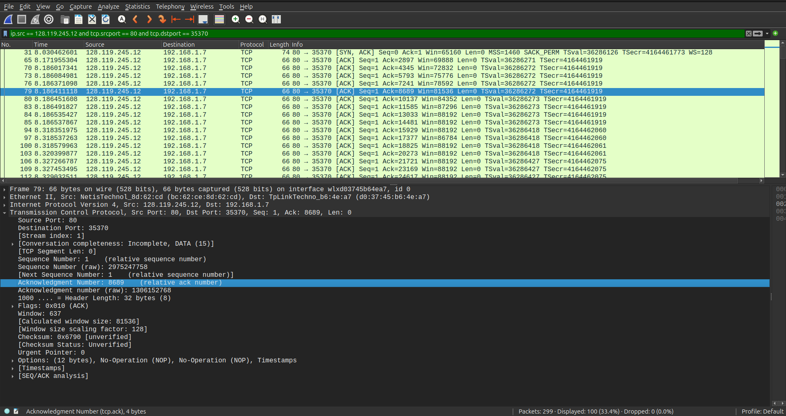
   - Соответствующие значения RTT для каждого из 6 сегментов равны:
     - $8.171955304 - 8.030643500 = 0.141311804 \text{ с}$,
     - $8.171955304 - 8.030652499 = 0.141302805 \text{ с}$,
     - $8.186017341 - 8.030660789 = 0.155356552 \text{ с}$,
     - $8.186084981 - 8.030664099 = 0.155420882 \text{ с}$,
     - $8.186371098 - 8.030783348 = 0.155587750 \text{ с}$,
     - $8.186411118 - 8.030789058 = 0.155622060 \text{ с}$.
7. Чему равна пропускная способность (количество байтов, передаваемых в единицу
   времени) для этого TCP-соединения? Объясните, как вы получили это значение.
   - `1744 кбит/с`.
   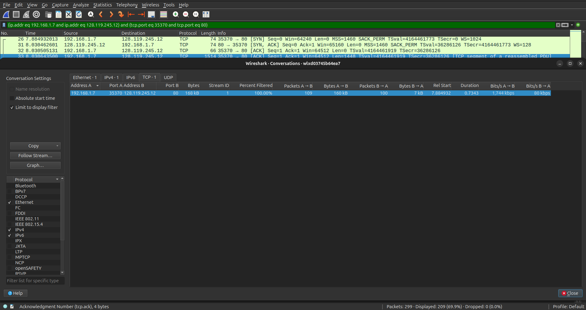
   - Это значение было получено в Wireshark из окна Statistics -> Conversations -> TCP для выбранного TCP-соединения 192.168.1.7:35370 -> 128.119.245.12:80. Там в столбце Bits/s A->B указана средняя скорость передачи данных от клиента к серверу, равная 1744 kbps.

### Работа с Time-Sequence-Graph (Stevens) (2 балла)
Time-Sequence-Graph (Stevens) (Временная шкала (Стивенса)) – одна из графических утилит
Wireshark для протокола TCP. Для того, чтобы ее запустить, выберите TCP-сегмент в окне
захваченных полученных пакетов. Затем выберите команду меню Statistics => TCP Stream Graph =>
Time-Sequence-Graph (Stevens) (Статистика => График TCP потока => Временная шкала (Стивенса)).
Каждая точка представляет отправленный TCP-сегмент, на графике изображена зависимость
порядкового номера сегмента от времени, когда он был отправлен.

#### Подготовка (такая же, как в предыдущем задании)
1. Откройте веб-браузер и перейдите по ссылке gaia.cs.umass.edu/wireshark-labs/alice.txt.
   Здесь вы найдете копию книги «Алиса в стране чудес» в формате ASCII. Сохраните этот файл на
   свой компьютер.
2. Перейдите по ссылке: gaia.cs.umass.edu/wireshark-labs/TCP-wireshark-file1.html. Сюда вы
   будете загружать ранее сохраненный файл.
3. Запустите Wireshark и начните перехват пакетов
4. Теперь загрузите текстовый файл «Алиса в стране чудес» на указанной в п.2 страничке
5. Остановите захват пакетов в приложении Wireshark. Используйте фильтр пакетов tcp.

#### Задание
Используйте инструмент построения графиков Time-Sequence-Graph (Stevens), чтобы представить
изменение порядковых номеров на временной шкале для сегментов, отправленных от клиента
серверу gaia.cs.umass.edu. Приложите соответствующий скрин программы Wireshark.

#### Скрин
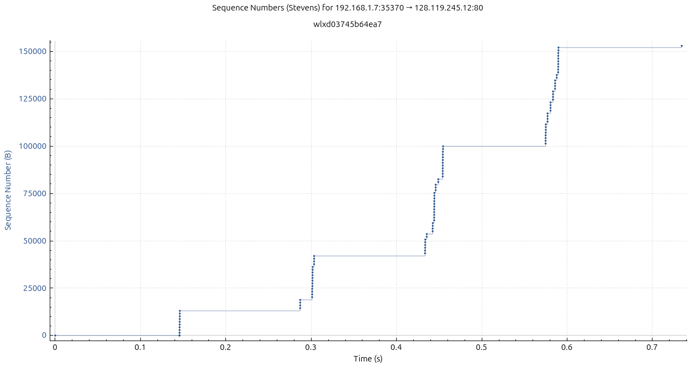

## Программирование. Эхо-запросы через UDP
Реализуйте сервер для пингования, а также его клиента.

### А. Серверная часть (2 балла)
Сервер находится в бесконечном цикле, ожидая приходящие UDP-пакеты.
Если пакет прибывает, то сервер просто изменяет символы входящего сообщения на заглавные и
отправляет их обратно клиенту. Серверный код должен моделировать 20% потерю пакетов.

### Б. Клиентская часть (2 балла)
Клиент должен отправить 10 эхо-запросов серверу. Поскольку UDP является ненадежным с точки
зрения доставки протоколом, то пакет, отправленный от клиента к серверу или наоборот, может
быть потерян в сети. Так как клиент не может бесконечно ждать ответа на запрос, нужно задать
период ожидания ответа (тайм-аут), равный одной секунде – если ответ не будет получен в
течение одной секунды, клиентская программа должна предполагать, что пакет потерян.

Ваша клиентская программа должна:
- отправить эхо-запрос, используя UDP
- распечатать ответное сообщение от сервера (если такое есть)
- вычислить и вывести на печать время оборота (RTT) в секундах для каждого пакета при
ответе сервера
- в противном случае, вывести сообщение «Request timed out»

Формат сообщения:
`Ping номер_последовательности время`
- номер_последовательности начинается с 1 и увеличивается до 10 для каждого
последующего сообщения, отправленного клиентом
- время – это момент времени, когда клиент отправляет сообщение

Сделайте скриншоты, подтверждающие корректную работу вашей программы пингования со стороны клиента.

#### Демонстрация работы
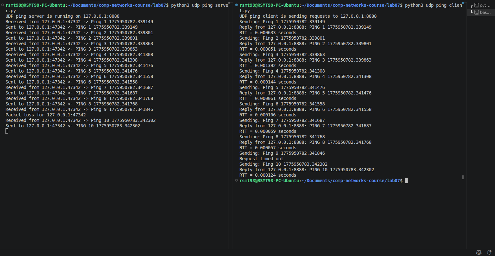

### В. Вывод в формате ping (2 балла)
Версия клиента из предыдущей части (Б) вычисляет время оборота для каждого пакета и выводит
его отдельно. Измените вывод таким образом, чтобы он соответствовал тому, как это делается в
стандартной утилите ping.

Для этого вам нужно будет сообщить минимальное, максимальное и среднее значение RTT в
конце каждого ответа от сервера. Дополнительно вычислите коэффициент потери пакетов (в
процентах).

#### Демонстрация работы
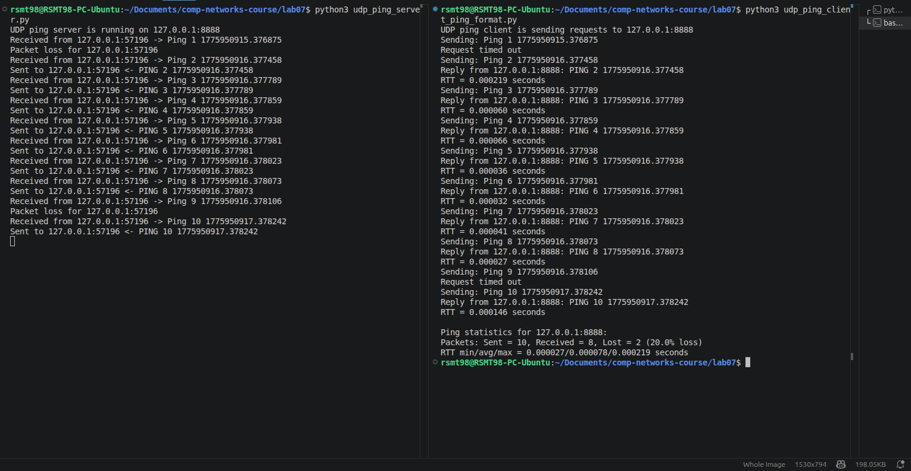

### Г. UDP Heartbeat (4 балла)
UDP Heartbeat (монитор доступности) подобен программе пингования. Он может быть
использован для проверки, работает ли приложение, и вывода сообщения об односторонней
потере пакетов.

Клиент отправляет порядковый номер и текущую временную метку в пакете UDP на сервер,
который слушает «сердцебиение» (т.е. ожидает UDP-пакеты) клиента. После получения пакетов
сервер вычисляет разницу во времени и сообщает о потерях. Если пакеты отсутствуют
определенный период времени, заданный параметром, то делается предположение, что
клиентское приложение остановлено и соответствующее сообщение выводится на консоль
сервера.

Реализуйте UDP Heartbeat (обе части – клиент и сервер), доработав обе ваши части программы
пингования из заданий А и Б.

Обратите внимание, что клиентов у сервера может быть сразу несколько одновременно.
Протестируйте такой сценарий.

#### Демонстрация работы
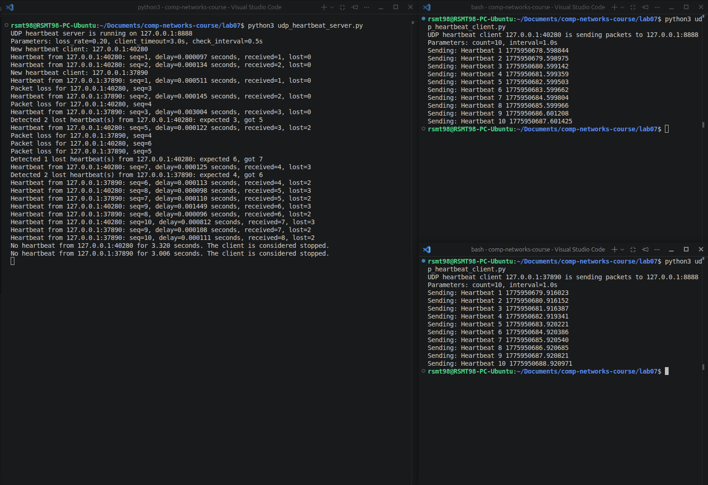

## Задачи

### Задача 1 (3 балла)
Рассмотрим протоколы GBN и SR. Предположим, пространство порядковых номеров имеет размер $k$.

Постановка задачи: найти наибольшее допустимое окно передачи, которое позволит обойти
возникновение проблемы, показанной на рисунке для каждого из этих протоколов?

Описание проблемы:
Отсутствие синхронизации между окнами отправителя и получателя имеет важные последствия,
когда мы сталкиваемся с ограниченностью диапазона порядковых номеров. Рассмотрим, что
могло бы произойти, например, если у нас есть четыре пакета с порядковыми номерами 0, 1, 2, 3,
а размер окна равен трем. Предположим, пакеты с 0 по 2 переданы отправителем, корректно
получены и подтверждены получателем. В этот момент окно получателя заполняется четвертым,
пятым и шестым пакетами, которые имеют порядковые номера 3, 0 и 1, соответственно. Теперь
рассмотрим два сценария.

В первом сценарии (на рисунке сверху) квитанции ACK на первые три пакета доставлены верно.
Таким образом, отправитель сдвигает окно вперед и отправляет четвертый, пятый и шестой
пакеты с порядковыми номерами 3, 0 и 1 соответственно.
Пакет с порядковым номером 3 потерян, но пакет с порядковым номером 0, **содержащий новые данные**, 
получен.

Во втором случае (рисунок снизу) ACK пакеты для первых трех пакетов данных потеряны, и
отправитель пересылает эти пакеты. Таким образом, получатель далее получает пакет с
порядковым номером 0 — **копию первого отправленного**.
Теперь рассмотрим ту же ситуацию с точки зрения принимающей стороны. Действия,
выполняемые передающей стороной, скрыты от нее; принимающая сторона способна лишь
следить за последовательностями получаемых пакетов и генерируемых квитанций. Подобная
ограниченность приводит к тому, что обе описанные выше ситуации воспринимаются
принимающей стороной как одинаковые. Она не может отличить исходную передачу пакета от
повторной.

#### Решение
Итак, мы не хотим, чтобы после циклического переполнения скользящего окна порядковых номеров приёмник перепутал старый дубликат с новым пакетом с тем же номером.  
Для этого нужно гарантировать, что ни один номер, который получатель сейчас готов принять как новый, не был одновременно номером пакета, который отправитель ещё может повторно послать как старый. Т.е. "множества номеров" у отправителя и у получателя не должны "перекрываться".

Пусть:
- $W$ — размер окна передачи;
- $A$ — размер множества номеров, которые получатель считает допустимыми к приёму.

Чтобы перекрытия этих множеств не возникало должно выполняться:

$$
W + A \le k.
$$

##### GBN

В GBN получатель принимает только следующий ожидаемый пакет, значит:

$$
A = 1.
$$

Получаем:

$$
W + 1 \le k \qquad \Longrightarrow \qquad W \le k - 1
$$

А значит, наибольшее допустимое окно передачи равно:

$$
\boxed{W = k - 1}
$$

##### SR

В SR же получатель может принять любые пакеты, которые могут прийти ему в текущий момент, даже те, которые пришли не по порядку, храня такие пакеты в буфере. Значит:

$$
A = W.
$$

Получаем:

$$
W + W \le k \qquad \Longrightarrow \qquad W \le \frac{k}{2}
$$

А значит, наибольшее допустимое окно передачи равно:

$$
\boxed{W = \left\lfloor \frac{k}{2} \right\rfloor}
$$

### Задача 2 (2 балла)
Представим себе следующую ситуацию: один хост расположен в Санкт-Петербурге, а другой — во
Владивостоке. Пусть время оборота RTT между этими двумя хостами приблизительно равно $30$ мс.
Предположим далее, что хосты соединены каналом со скоростью передачи $R$, равной $1$ Гбит/с
($10^9$ бит/с).

Предположим, что размер передаваемого пакета составляет $1500$ байт, включая поля
заголовка и данные.

Насколько большим должен быть размер окна $n$, чтобы использование канала составило
более $98$ процентов?

#### Решение
Для протокола со скользящим окном из $n$ пакетов коэффициент использования канала можно оценить как

$$
\frac{n \cdot (L/R)}{RTT + L/R},
$$

где:
- $L$ — размер пакета в битах,
- $R$ — скорость канала.

Найдём время передачи одного пакета:

$$
\frac{L}{R} = \frac{12000}{10^9} = 1.2 \cdot 10^{-5} \text{ с} = 0.012 \text{ мс}
$$

Хотим:

$$
\frac{n \cdot (L/R)}{RTT + L/R} > 0.98
$$

Подставим числа в формулу:

$$
\frac{n \cdot 0.012}{30 + 0.012} > 0.98 \qquad \Longrightarrow \qquad n > 0.98 \cdot \frac{30.012}{0.012} = 0.98 \cdot 2501 = 2450.98
$$

Размер окна должен быть целым числом, следовательно ответ:

$$
\boxed{n \ge 2451}
$$
