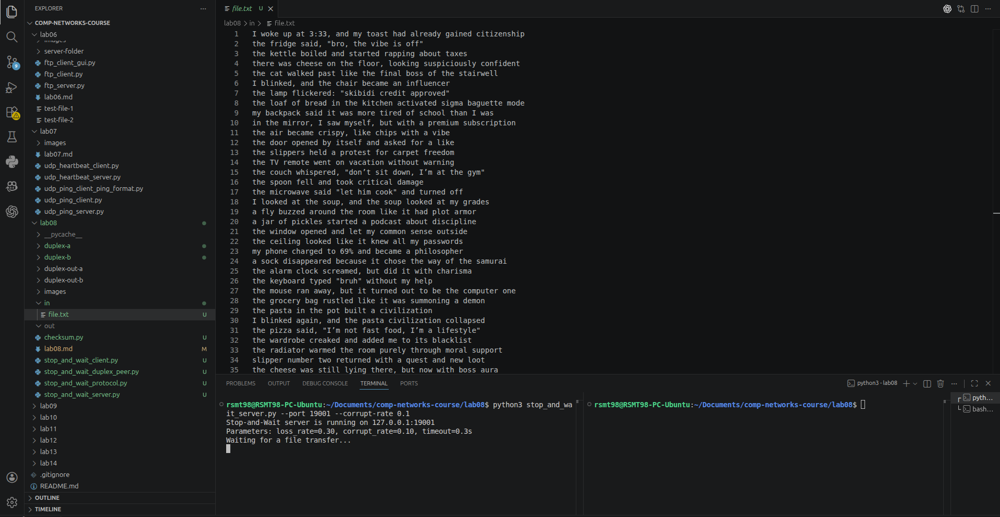
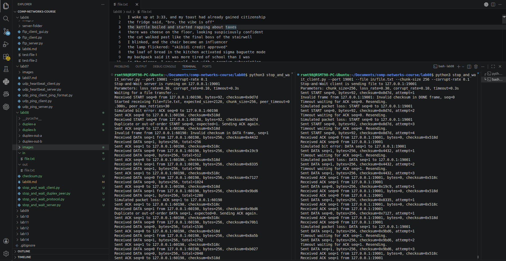
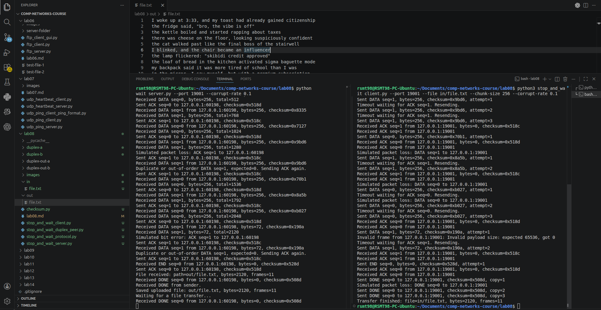
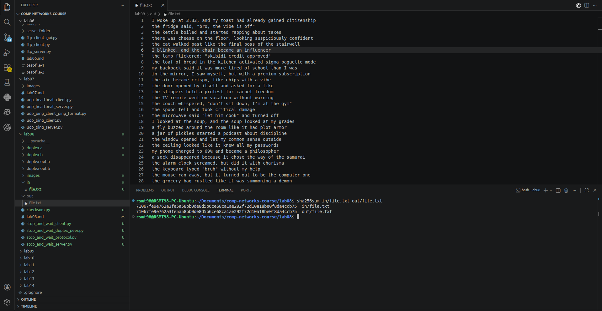
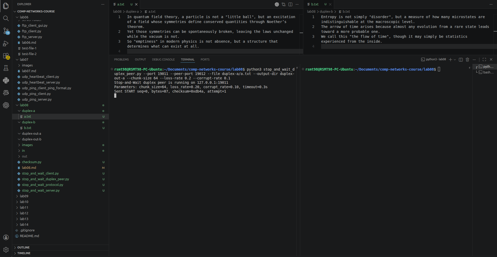
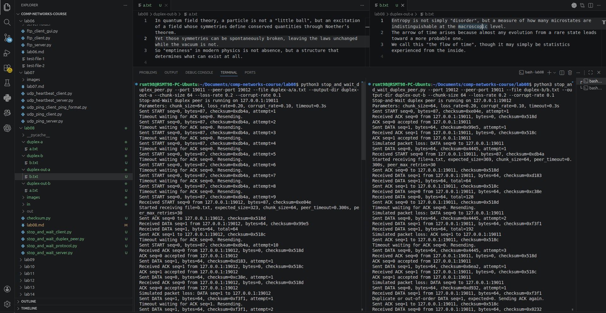
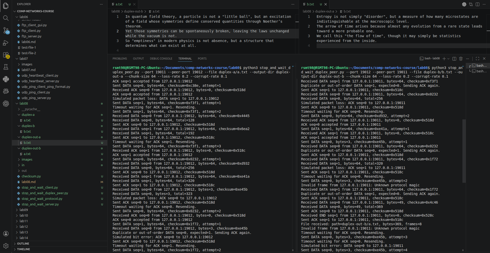
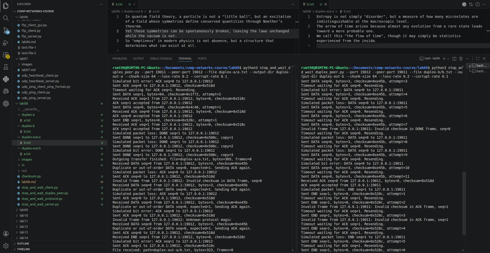
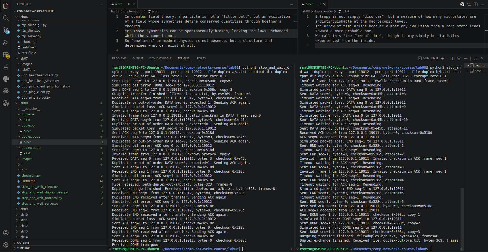
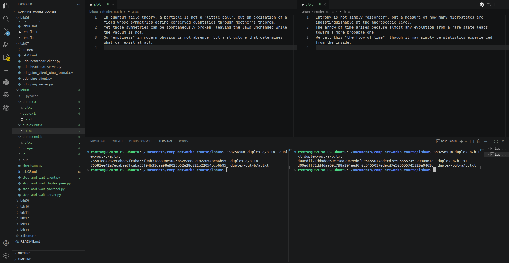

# Практика 8. Транспортный уровень

## Реализация протокола Stop and Wait (8 баллов)
Реализуйте свой протокол надежной передачи данных типа Stop and Wait на основе ненадежного
транспортного протокола UDP. В вашем протоколе, реализованном на прикладном уровне,
отправитель отправляет пакет (frame) с данными, а затем ожидает подтверждения перед
продолжением.

**Клиент**
- отправляет пакет и ожидает подтверждение ACK от сервера в течение заданного времени (тайм-аута)
- если ACK не получен, пакет отправляется снова
- все пакеты имеют номер (0 или 1) на случай, если один из них потерян

**Сервер**
- ожидает пакеты, отправляет ACK, когда пакет получен
- отправленный ACK должен иметь тот же номер, что и полученный пакет

Вы можете использовать схему, которая была рассмотрена на лекции в рамках обсуждения
протокола rdt3.0, как пример:

### А. Общие требования (5 баллов)
- В качестве базового протокола используйте UDP. Поддержите имитацию 30% потери
  пакетов. Потеря может происходить в обоих направлениях (от клиента серверу и от
  сервера клиенту).
- Должен быть поддержан настраиваемый таймаут.
- Должна быть обработка ошибок (как на сервере, так и на клиенте).
- В качестве демонстрации работоспособности вашего решения передайте через свой
  протокол файл (от клиента на сервер), разбив его на несколько пакетов перед отправкой
  на стороне клиента и собрав из отдельных пакетов в единый файл на стороне сервера.
  Файл и размеры пакетов выберите самостоятельно.

Приложите скриншоты, подтверждающие работоспособность программы.

#### Демонстрация работы
> Ненулевой `--corrupt-rate` здесь демонстрирует корректность решения задания В.

### Б. Дуплексная передача (2 балла)
Поддержите возможность пересылки данных в обоих направлениях: как от клиента к серверу, так и
наоборот. 

Продемонстрируйте передачу файла от сервера клиенту.

#### Демонстрация работы

### В. Контрольные суммы (1 балл)
UDP реализует механизм контрольных сумм при передаче данных. Однако предположим, что
этого нет. Реализуйте и интегрируйте в протокол свой способ проверки корректности данных
на прикладном уровне (для этого вы можете использовать результаты из следующего задания
«Контрольные суммы»).

## Контрольные суммы (2 балла)
Методы, основанные на использовании контрольных сумм, обрабатывают $d$ разрядов данных как
последовательность $k$-разрядных целых чисел.
Наиболее простой метод заключается в простом суммировании этих $k$-разрядных целых чисел и
использовании полученной суммы в качестве битов определения ошибок. Так работает алгоритм
вычисления контрольной суммы, принятый в Интернете, — байты данных группируются в $16$-
разрядные целые числа и суммируются. Затем от суммы берется обратное значение (дополнение
до $1$), которое и помещается в заголовок сегмента.

Получатель проверяет контрольную сумму, складывая все числа из данных (включая контрольную
сумму), и сравнивает результат с числом, все разряды которого равны $1$. Если хотя бы один из
разрядов результата равен $0$, это означает, что произошла ошибка.
В протоколах TCP и UDP контрольная сумма вычисляется по всем полям (включая поля заголовка и
данных).

Реализуйте функцию для подсчета контрольной суммы, а также функцию для проверки, что
данные соответствуют контрольной сумме.

**Требования**
- Функция 1 принимает на вход массив байт и возвращает контрольную сумму (число).
- Функция 2 принимает на вход массив байт и контрольную сумму и проверяет,
соответствует ли сумма переданным данным. Размер входного массива ограничен сверху
числом байтов ($= L$), однако данные могут поступать разной длины ($\le L$).

Добавьте два-три теста, покрывающих как случаи
корректной работы, так и случаи ошибки в данных (сбой битов). Вы можете не использовать
тестовые фреймворки и реализовать тестовые сценарии в консольном приложении.

## Задачи

### Задача 1 (2 балла)
Пусть $T$ (измеряется в RTT) обозначает интервал времени, который TCP-соединение тратит на
увеличение размера окна перегрузки с $\frac{W}{2}$ до $W$, где $W$ – это максимальный размер окна
перегрузки. Докажите, что $T$ – это функция от средней пропускной способности TCP.

#### Решение
Полагаем, что $W$ измеряется в байтах (а не сразу в MSS).

Т.к. окно увеличивается на $1$ MSS за RTT, количество RTT, необходимое для роста окна на $\frac{W}{2}$ байт, равно

$$
T = \frac{\frac{W}{2}}{MSS} = \frac{W}{2MSS}.
$$

Окно меняется линейно от $\frac{W}{2}$ до $W$, поэтому средний размер окна перегрузки равен

$$
W_{avg} = \frac{\frac{W}{2} + W}{2} = \frac{3W}{4}.
$$

Средняя пропускная способность TCP равна среднему размеру окна, делённому на RTT:

$$
R_{avg} = \frac{W_{avg}}{RTT}.
$$

Подставим найденное среднее окно:

$$
R_{avg} = \frac{3W}{4RTT}.
$$

Отсюда выразим $W$:

$$
W = \frac{4R_{avg}RTT}{3}.
$$

Подставим это значение в формулу для $T$:

$$
T = \frac{1}{2MSS} \cdot \frac{4R_{avg}RTT}{3} = \frac{2R_{avg}RTT}{3MSS}.
$$

При фиксированных значениях $RTT$ и $MSS$ величина $T$ однозначно определяется средней пропускной способностью TCP $R_{avg}$, а значит, $T$ действительно является функцией от средней пропускной способности TCP.

### Задача 2 (3 балла)
Рассмотрим задержку, полученную в фазе медленного старта TCP. Рассмотрим клиент и веб-сервер, напрямую соединенные одним каналом со скоростью передачи данных $R$.
Предположим, клиент хочет получить от сервера объект, размер которого точно равен $15 \cdot S$,
где $S$ – это максимальный размер сегмента.
Игнорируя заголовки протокола, определите время извлечения объекта (общее время
задержки), включая время на установление TCP-соединения (предполагается, что RTT - константа), если:
1. $\dfrac{4S}{R} > \dfrac{S}{R} + RTT > \dfrac{2S}{R}$
2. $\dfrac{𝑆}{𝑅} + 𝑅𝑇𝑇 > \dfrac{4𝑆}{𝑅}$
3. $\dfrac{𝑆}{𝑅} > 𝑅𝑇𝑇$

#### Решение
В фазе медленного старта начальное окно перегрузки равно одному сегменту, а затем растёт удвоением, а т.к.

$$
1 + 2 + 4 + 8 = 15,
$$

то для передачи всего объекта нужны ровно 4 "порции" сегментов.

Время извлечения объекта включает:

- $1\ RTT$ на установление TCP-соединения;
- ещё $1\ RTT$ на отправку HTTP-запроса и получение начала ответа;
- собственно, саму передачу данных с учётом возможных ожиданий подтверждений.

Поэтому базово имеем:

$$
2RTT + \frac{15S}{R}
$$

Остаётся добавить задержки ожидания ACK:
- после отправки 1-ого сегмента сервер ждёт ACK, поэтому возникает задержка в $1\ RTT$;
- после окна из 2-ух сегментов задержка возникает, если ACK 1-ого сегмента из этого окна приходит позже, чем сервер закончит передавать оба сегмента.  
Время прихода ACK для первого сегмента окна равно $\frac{S}{R} + RTT$.  
На передачу окна из 2-ух сегментов нужно $\frac{2S}{R}$.  
Значит, задержка равна $\max((\frac{S}{R} + RTT) - \frac{2S}{R}, 0) = \max(RTT - \frac{S}{R}, 0)$;
- после окна из 4-ёх сегментов возможная задержка равна $\max(RTT - \frac{3S}{R}, 0)$

После окна из 8-ми сегментов ждать уже не нужно, ибо объект полностью передан.  

Итого имеем, что время извлечения объекта равно:

$$
T = 2RTT + \frac{15S}{R} + RTT + \max(RTT - \frac{S}{R}, 0) + \max(RTT - \frac{3S}{R}, 0)
$$

###### 1. Случай $\dfrac{4S}{R} > \dfrac{S}{R} + RTT > \dfrac{2S}{R}$

В этом случае имеем:

$$
\frac{3S}{R} > RTT > \frac{S}{R}
$$

Значит:

$$
\max(RTT - \frac{S}{R}, 0) = RTT - \frac{S}{R} \quad и \quad \max(RTT - \frac{3S}{R}, 0) = 0
$$

Тогда ответ равен:

$$
\boxed{T = 2RTT + \frac{15S}{R} + RTT + RTT - \frac{S}{R} = 4RTT + \frac{14S}{R}}
$$

###### 2. Случай $\dfrac{𝑆}{𝑅} + 𝑅𝑇𝑇 > \dfrac{4𝑆}{𝑅}$

В этом случае имеем:

$$
RTT > \frac{3S}{R}
$$

Значит:

$$
\max(RTT - \frac{S}{R}, 0) = RTT - \frac{S}{R} \quad и \quad \max(RTT - \frac{3S}{R}, 0) = RTT - \frac{3S}{R}
$$

Тогда ответ равен:

$$
\boxed{T = 2RTT + \frac{15S}{R} + RTT + RTT - \frac{S}{R} + RTT - \frac{3S}{R} = 5RTT + \frac{11S}{R}}
$$

###### 3. Случай $\dfrac{𝑆}{𝑅} > 𝑅𝑇𝑇$

Из этого условия следует, что:

$$
\max(RTT - \frac{S}{R}, 0) = 0 \quad и \quad \max(RTT - \frac{3S}{R}, 0) = 0
$$

Тогда ответ равен:

$$
\boxed{T = 2RTT + \frac{15S}{R} + RTT = 3RTT + \frac{15S}{R}}
$$

### Задача 3 (2 балла)
Рассмотрим модификацию алгоритма управления перегрузкой протокола TCP. Вместо
аддитивного увеличения, мы можем использовать мультипликативное увеличение. TCP-отправитель увеличивает размер своего окна в $(1 + a)$ раз (где $a$ - небольшая положительная
константа: $0 < a < 1$), как только получает верный ACK-пакет.
Найдите функциональную зависимость между частотой потерь $L$ и максимальным размером окна
перегрузки $W$. Утверждается, что для этого измененного протокола TCP, независимо от средней
пропускной способности TCP-соединения всегда требуется одинаковое количество времени для
увеличения размера окна перегрузки с $\frac{W}{2}$ до $W$.

#### Решение
Обозначим через $C_n$ размер окна после $n$ корректных ACK. Тогда

$$
C_n = \frac{W}{2}(1+a)^n.
$$

Окно снова достигнет значения $W$, когда

$$
\frac{W}{2}(1+a)^n = W.
$$

Отсюда

$$
(1+a)^n = 2,
$$

поэтому

$$
n = \log_{1+a}2 = \frac{\ln 2}{\ln(1+a)}.
$$

Видим, что для роста окна от $W/2$ до $W$ требуется фиксированное число корректных ACK, ну и значит это число никак не зависит от $W$. Следовательно,

$$
n(W) = \Theta(1).
$$

Чем больше число успешно подтвержденных пакетов, тем меньше будет значение частоты потерь, а значит

$$
L(n) = \Theta\left(\frac{1}{n}\right),
$$

а из рассуждений выше получаем

$$
\boxed{L(W) = \Theta(1)}
$$

### Задача 4. Расслоение TCP (2 балла)
Для облачных сервисов, таких как поисковые системы, электронная почта и социальные сети,
желательно обеспечить малое время отклика если конечная система расположена далеко от датацентра, то значение RTT будет большим, что может привести к неудовлетворительному времени
отклика, связанному с этапом медленного старта протокола TCP.
Рассмотрим задержку получения ответа на поисковый запрос. Обычно серверу требуется три окна
TCP на этапе медленного старта для доставки ответа. Таким образом, время с момента, когда
конечная система инициировала TCP-соединение, до времени, когда она получила последний
пакет в ответ, составляет примерно $4$ RTT (один RTT для установления TCP-соединения, плюс три
RTT для трех окон данных) плюс время обработки в дата-центре. Такие RTT задержки могут
привести к заметно замедленной выдаче результатов поиска для многих запросов. Более того,
могут присутствовать также и значительные потери пакетов в сетях доступа, приводящие к
повторной передаче TCP и еще большим задержкам.

Один из способов смягчения этой проблемы и улучшения восприятия пользователем
производительности заключается в том, чтобы:
- развернуть внешние серверы ближе к пользователям
- использовать расслоение TCP путем разделения TCP-соединения на внешнем сервере.
При расслоении клиент устанавливает TCP-соединение с ближайшим внешним сервером, который
поддерживает постоянное TCP-соединение с дата-центром с очень большим окном перегрузки TCP.

При использовании такого подхода время отклика примерно равно:
$$4 \cdot RTT_{FE} + RTT_{BE} + \text{ время обработки}~~~~~~~(1)$$
где $RTT_{FE}$ — время оборота между клиентом и внешним сервером, и $RTT_{BE}$ — время оборота
между внешним сервером и дата-центром (внутренним сервером). Если внешний сервер закрыт
для клиента, то это время ответа приближается к $RTT$ плюс время обработки, поскольку значение
$RTT_{FE}$ ничтожно мало и значение $RTT_{BE}$ приблизительно равно $RTT$. В итоге расслоение TCP
может уменьшить сетевую задержку, грубо говоря, с $4 \cdot RTT$ до $RTT$, значительно повышая
субъективную производительность, особенно для пользователей, которые расположены далеко
от ближайшего дата-центра.

Расслоение TCP также помогает сократить задержку повторной передачи TCP, вызванную
потерями в сетях.

Докажите утверждение $(1)$. 

#### Решение
Сначала клиенту нужно установить TCP-соединение с ближайшим внешним сервером, что займёт

$$
RTT_{FE} \quad (1)
$$

После этого клиент может отправить поисковый запрос внешнему серверу.  
Внешний сервер уже поддерживает постоянное TCP-соединение с дата-центром, поэтому при отправке запроса не нужно между ними заново ничего устанавливать и не нужно снова испытывать задержку медленного старта.  
Кроме того, раз это соединение имеет большое окно перегрузки, то ответ дата-центра можно передать внешнему серверу без дополнительных трёх окон медленного старта.  
Чтобы внешний сервер отправил запрос в дата-центр, потребуется

$$
RTT_{BE} \quad (2)
$$

Плюс само время обработки запроса в дата-центре:

$$
\text{время обработки} \quad (3)
$$

Теперь внешний сервер должен передать ответ клиенту.
Поскольку соединение между клиентом и внешним сервером только что установлено, оно находится на этапе медленного старта. А т.к. по условию серверу обычно требуется три окна TCP, чтобы доставить весь ответ, и т.к. каждое окно данных фактически добавляет один $RTT_{FE}$, то доставка ответа клиенту займёт

$$
3 \cdot RTT_{FE} \quad (4)
$$

Сложив $(1)$, $(2)$, $(3)$ и $(4)$, мы и получим значение из утверждения, которое доказывали.
