# Практика 9. Сетевой уровень

## Wireshark: ICMP
В лабораторной работе предлагается исследовать ряд аспектов протокола ICMP:
- ICMP-сообщения, генерируемые программой Ping
- ICMP-сообщения, генерируемые программой Traceroute
- Формат и содержимое ICMP-сообщения

### 1. Ping (4 балла)
Программа Ping на исходном хосте посылает пакет на целевой IP-адрес; если хост с этим адресом
активен, то программа Ping на нем откликается, отсылая ответный пакет хосту, инициировавшему
связь. Оба этих пакета Ping передаются по протоколу ICMP.

Выберите какой-либо хост, расположенный на другом континенте (например, в Америке или
Азии). Захватите с помощью Wireshark ICMP пакеты от утилиты ping.
Для этого из командной строки запустите команду (аргумент `-n 10` означает, что должно быть
отослано 10 ping-сообщений): `ping –n 10 host_name`

Для анализа пакетов в Wireshark введите строку icmp в области фильтрации вывода.

#### Вопросы
1. Каков IP-адрес вашего хоста? Каков IP-адрес хоста назначения?
   - `192.168.1.5`  
   
   - `128.119.245.12`  
   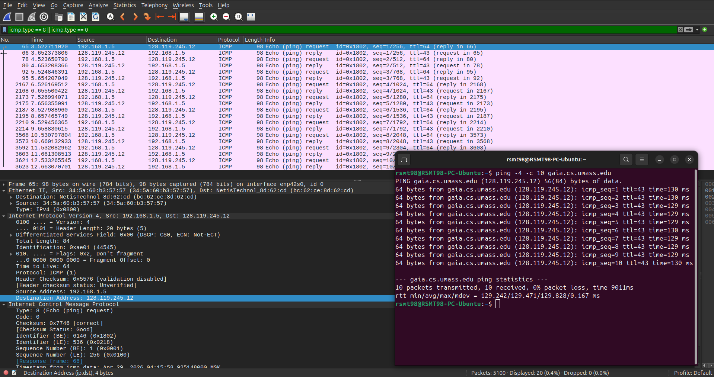
2. Почему ICMP-пакет не обладает номерами исходного и конечного портов?
   - Потому что ICMP - протокол сетевого уровня, а не транспортного. Ему не нужны порты, ибо он передаёт данные не между приложениями, а между сетевыми узлами.
3. Рассмотрите один из ping-запросов, отправленных вашим хостом. Каковы ICMP-тип и кодовый
   номер этого пакета? Какие еще поля есть в этом ICMP-пакете? Сколько байт приходится на поля 
   контрольной суммы, порядкового номера и идентификатора?
   - `Type: 8` и `Code: 0`  
   
   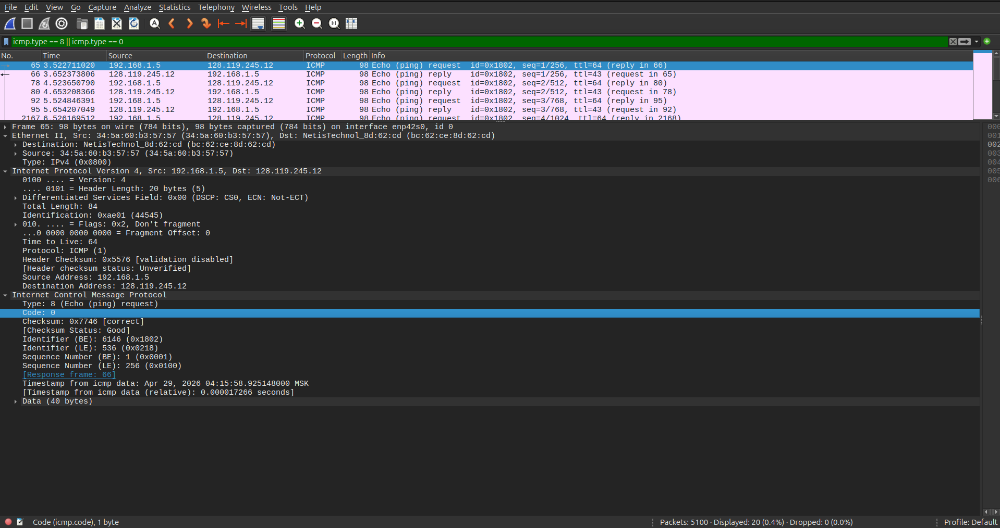
   - Помимо `Type` и `Code`, есть также `Checksum`, `Identifier`, `Sequence Number`, `Timestamp from ICMP data` и `Data`.
   - `Checksum` — `2 байта`; `Sequence Number` — `2 байта`; `Identifier` — `2 байта`  
   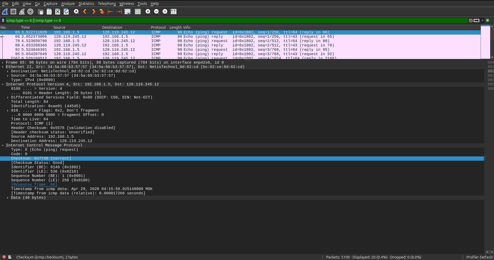
   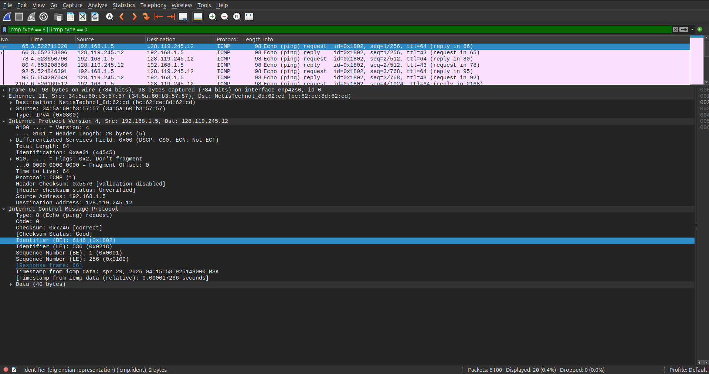
   
4. Рассмотрите соответствующий ping-пакет, полученный в ответ на предыдущий. 
   Каковы ICMP-тип и кодовый номер этого пакета? Какие еще поля есть в этом ICMP-пакете? 
   Сколько байт приходится на поля контрольной суммы, порядкового номера и идентификатора?
   - `Type: 0` и `Code: 0`  
   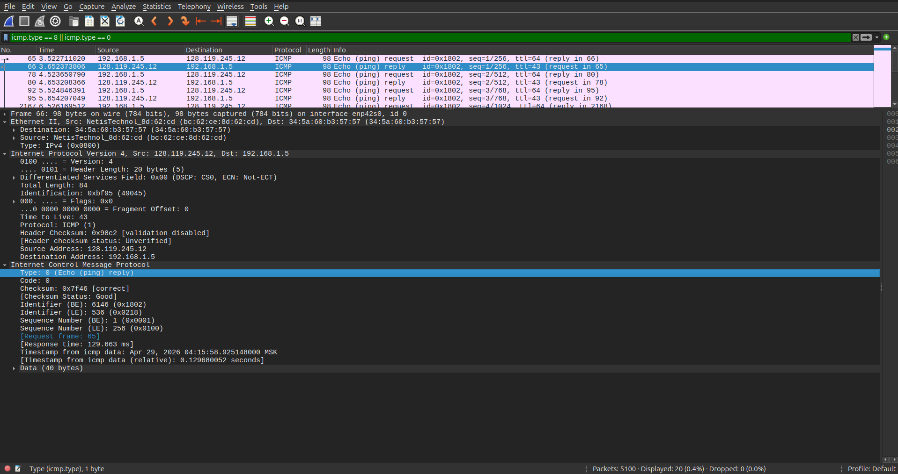
   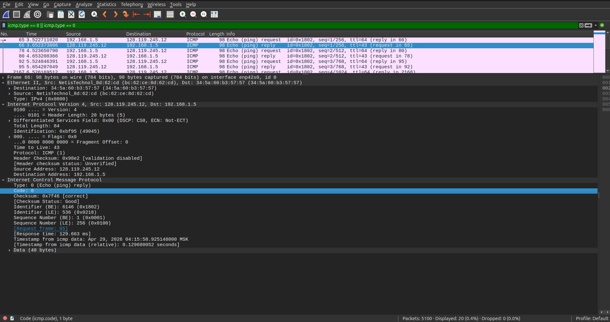
   - Помимо `Type` и `Code`, есть также `Checksum`, `Identifier`, `Sequence Number`, `Timestamp from ICMP data` и `Data`.
   - `Checksum` — `2 байта`; `Sequence Number` — `2 байта`; `Identifier` — `2 байта`  
   
   
   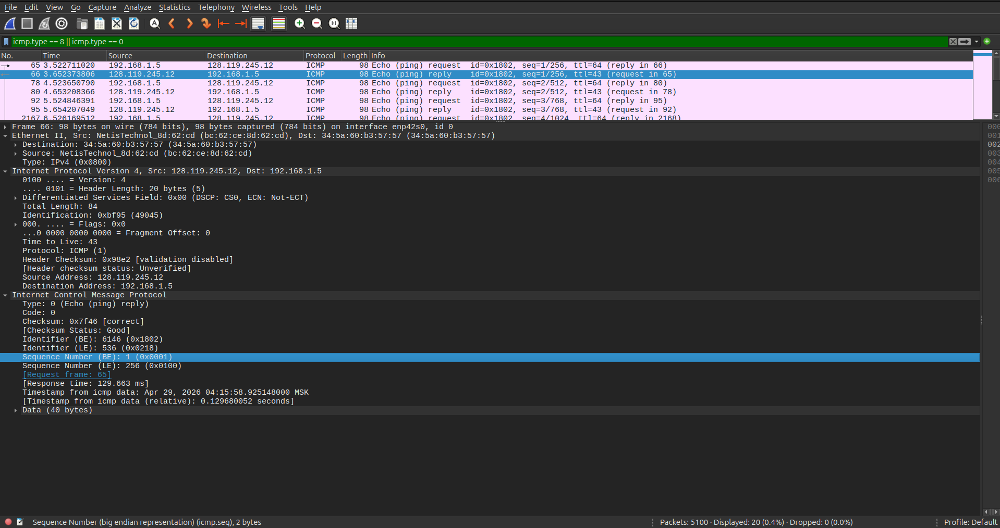

### 2. Traceroute (4 балла)
Программа Traceroute может применяться для определения пути, по которому пакет попал с
исходного на конечный хост.

Traceroute отсылает первый пакет со значением TTL = 1, второй – с TTL = 2 и т.д. Каждый
маршрутизатор понижает TTL-значение пакета, когда пакет проходит через этот маршрутизатор.
Когда на маршрутизатор приходит пакет со значением TTL = 1, этот маршрутизатор отправляет
обратно к источнику ICMP-пакет, свидетельствующий об ошибке.

Задача – захватить ICMP пакеты, инициированные программой traceroute, в сниффере Wireshark.
В ОС Windows вы можете запустить: `tracert host_name`

Выберите хост, который **расположен на другом континенте**.

#### Вопросы
1. Рассмотрите ICMP-пакет с эхо-запросом на вашем скриншоте. Отличается ли он от ICMP-пакетов
   с ping-запросами из Задания 1 (Ping)? Если да – то как?
   - По самой структуре ICMP-заголовка - толком не отличается. Но есть отличие в самом IP-заголовке: traceroute отправляет запрос с постепенно увеличивающимся TTL.  
   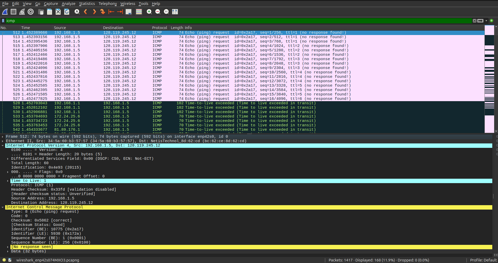  
   На скриншоте видно, как первые ICMP запросы отправляются с TTL = 1, а затем TTL увеличивается у более поздних фреймов.
2. Рассмотрите на вашем скриншоте ICMP-пакет с сообщением об ошибке. В нем больше полей,
   чем в ICMP-пакете с эхо-запросом. Какая информация содержится в этих дополнительных полях?
   - ICMP-пакет с сообщением об ошибке содержит информацию об исходном пакете, который вызвал ошибку.  
   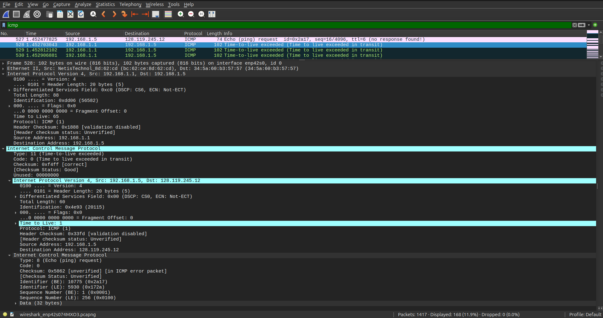  
   На скриншоте видно, что внутри ICMP-сообщения об ошибке находится копия исходного IPv4-пакета от 192.168.1.5 к 128.119.245.12 с TTL = 1. Также виден сам исходный ICMP запрос с его полями.
3. Рассмотрите три последних ICMP-пакета, полученных исходным хостом. Чем эти пакеты
   отличаются от ICMP-пакетов, сообщающих об ошибках? Чем объясняются такие отличия?
   - Тем, что это уже полноценные обычные ICMP-ответы с ICMP-типом 0 от конечного хоста, а не TTL-ошибки с ICMP-типом 11.  
   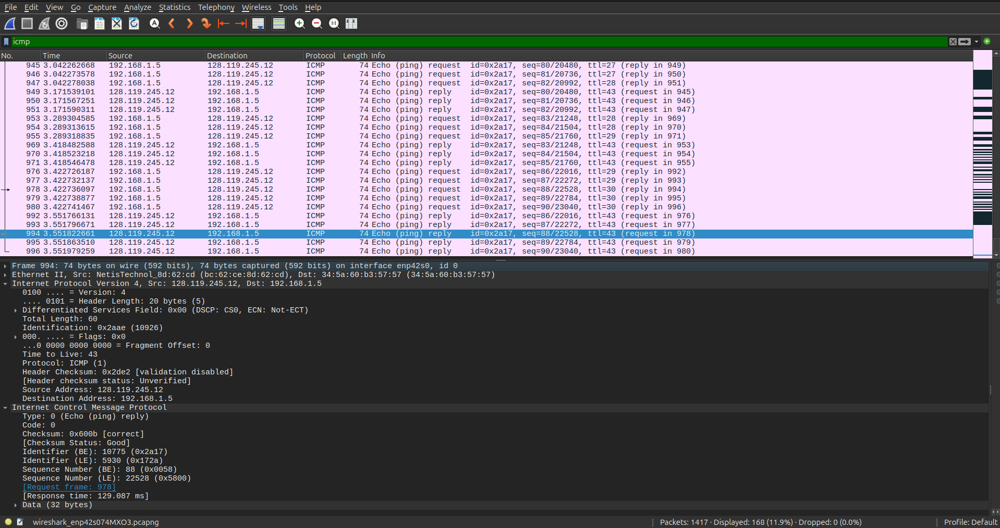
   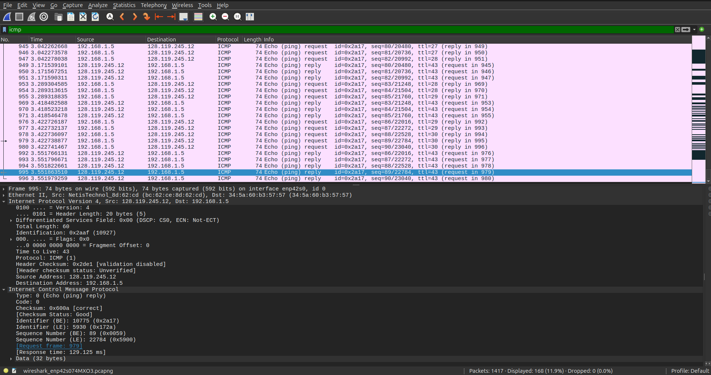
   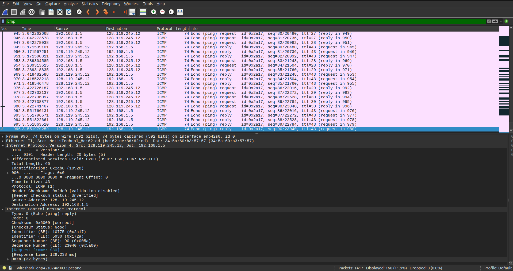
   - Такие отличия объясняются тем, что, благодаря тому, что последние пакеты traceroute накопили достаточно большое значение TTL, они смогли дойти до конечного хоста, который, в свою очередь, обработал ICMP запрос и отправил обычный соответствующий ICMP ответ.
4. Есть ли такой канал, задержка в котором существенно превышает среднее значение? Можете
   ли вы, опираясь на имена маршрутизаторов, определить местоположение двух маршрутизаторов,
   расположенных на обоих концах этого канала?
   - Да, существенный скачок задержки наблюдается между хопами 14 и 15.  
   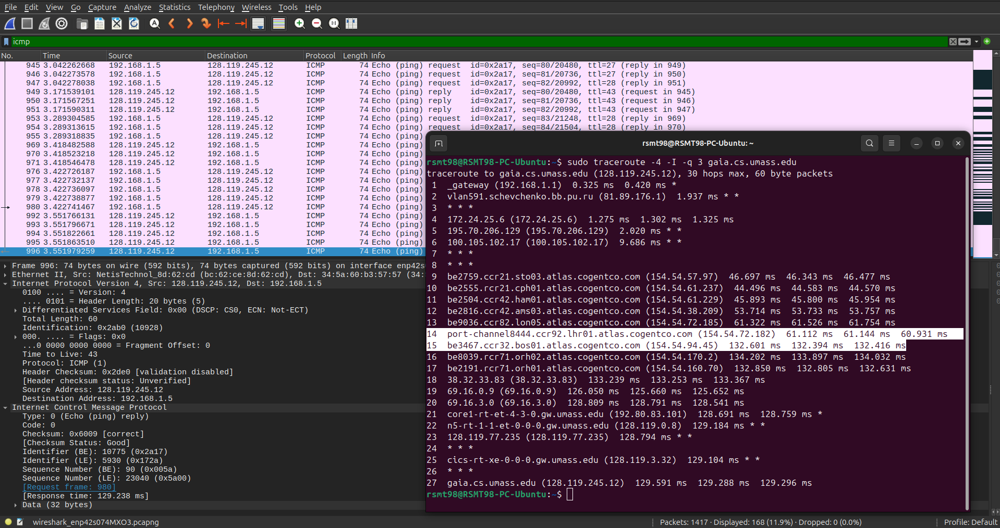
   - По именам маршрутизаторов можно предположить, что маршрутизатор хопа 14 находится в Лондоне *(судя по фрагменту `lhr01` в имени этого маршрутизатора, а также по фрагменту `lon05` в имени предыдущего маршрутизатора)*, а маршрутизатор хопа 15 - в Бостоне *(судя по фрагменту `bos01`)*.

## Программирование.

### 1. IP-адрес и маска сети (1 балл)
Напишите консольное приложение, которое выведет IP-адрес вашего компьютера и маску сети на консоль.

#### Демонстрация работы
> Вообще "IP компьютера" - понятие философское :) У компьютера же может быть несколько сетевых интерфейсов и, соответственно, IP-адресов.  
Поэтому это решение выводит тот IP-адрес (ну и маску сети), который используется для выхода к некоторому внешнему адресу `--target-host` (по умолчанию - `8.8.8.8`).

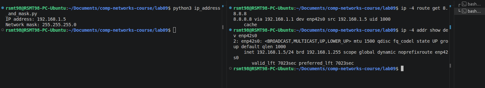

### 2. Доступные порты (2 балла)
Выведите все доступные (свободные) порты в указанном диапазоне для заданного IP-адреса. 
IP-адрес и диапазон портов должны передаваться в виде входных параметров.

#### Демонстрация работы
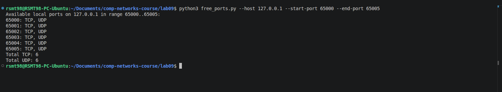
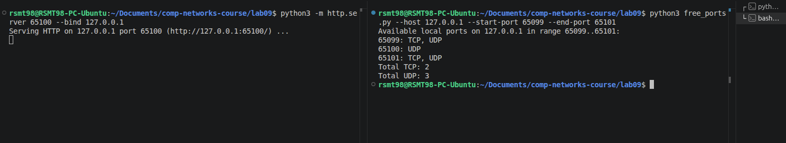

### 3. Широковещательная рассылка для подсчета копий приложения (6 баллов)
Разработать приложение, подсчитывающее количество копий себя, запущенных в локальной сети.
Приложение должно использовать набор сообщений, чтобы информировать другие приложения
о своем состоянии. После запуска приложение должно рассылать широковещательное сообщение
о том, что оно было запущено. Получив сообщение о запуске другого приложения, оно должно
сообщать этому приложению о том, что оно работает. Перед завершением работы приложение
должно информировать все известные приложения о том, что оно завершает работу. На экран
должен выводиться список IP адресов компьютеров (с указанием портов), на которых приложение
запущено.

Приложение считает другое приложение запущенным, если в течение промежутка времени,
равного нескольким интервалам между рассылками широковещательных сообщений, от него
пришло сообщение.

**Такое приложение может быть использовано, например, при наличии ограничения на
количество лицензионных копий программ.*

Пример GUI:

#### Демонстрация работы
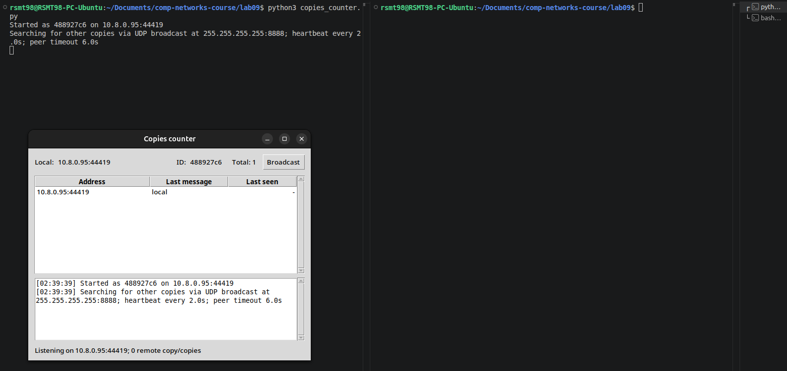
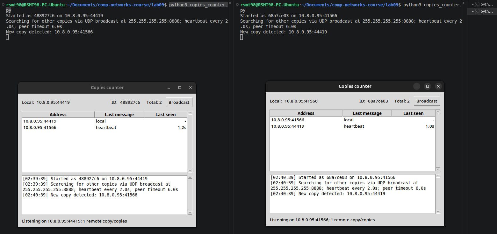
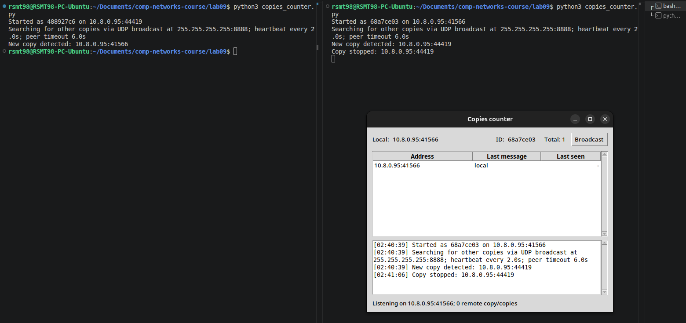

## Задачи. Работа протокола TCP

### Задача 1. Докажите формулы (3 балла)
Пусть за период времени, в который изменяется скорость соединения с $\frac{W}{2 \cdot RTT}$
до $\frac{W}{RTT}$, только один пакет был потерян (очень близко к концу периода).
1. Докажите, что частота потери $L$ (доля потерянных пакетов) равна
   $$L = \dfrac{1}{\frac{3}{8} W^2 + \frac{3}{4} W}$$
2. Используйте выше полученный результат, чтобы доказать, что, если частота потерь равна
   $L$, то средняя скорость приблизительно равна
   $$\approx \dfrac{1.22 \cdot MSS}{RTT \cdot \sqrt{L}}$$

#### Решение
###### 1.
За каждый $RTT$ окно перегрузки увеличивается примерно на $1$ пакет. Значит, за рассматриваемый период значения окна равны

$$
\frac{W}{2}, \frac{W}{2} + 1, \frac{W}{2} + 2, \ldots, W.
$$

Число таких раундов равно

$$
W - \frac{W}{2} + 1 = \frac{W}{2} + 1.
$$

В каждом раунде отправляется число пакетов, примерно равное текущему размеру окна. Поэтому общее число отправленных пакетов за период равно сумме арифметической прогрессии:

$$
N = \left(\frac{W}{2} + 1\right) \cdot \frac{\frac{W}{2} + W}{2} = \left(\frac{W}{2} + 1\right) \cdot \frac{3W}{4} = \frac{3W^2}{8} + \frac{3W}{4}.
$$

По условию за весь этот период потерян только один пакет. Частота потерь $L$ — это доля потерянных пакетов среди всех отправленных пакетов, значит

$$
L = \frac{1}{N}.
$$

Подставляя найденное значение $N$, получаем

$$
L = \frac{1}{\frac{3}{8}W^2 + \frac{3}{4}W}.
$$

**ЧТД**.

###### 2.
Среднее значение окна перегрузки за период примерно равно среднему между минимальным и максимальным значениями окна:

$$
W_{avg} \approx \frac{\frac{W}{2} + W}{2} = \frac{3W}{4}.
$$

Следовательно, средняя скорость передачи равна

$$
R_{avg} \approx \frac{W_{avg} \cdot MSS}{RTT}.
$$

Подставим $W_{avg} \approx \frac{3W}{4}$:

$$
R_{avg} \approx \frac{3W \cdot MSS}{4 \cdot RTT}.
$$

Из первой части имеем

$$
L = \frac{1}{\frac{3}{8}W^2 + \frac{3}{4}W}.
$$

Если $W$ достаточно велико, то член $\frac{3}{4}W$ мал по сравнению с $\frac{3}{8}W^2$, поэтому

$$
L \approx \frac{1}{\frac{3}{8}W^2} = \frac{8}{3W^2}.
$$

Следовательно,

$$
W^2 \approx \frac{8}{3L}.
$$

$$
W \approx \sqrt{\frac{8}{3L}}.
$$

Теперь подставим это в формулу для средней скорости:

$$
R_{avg} \approx \frac{3 \cdot MSS}{4 \cdot RTT} \cdot \sqrt{\frac{8}{3L}} = \frac{MSS}{RTT \cdot \sqrt{L}} \cdot \frac{3}{4} \sqrt{\frac{8}{3}}.
$$

Этот числовой коэффициент можно расписать как

$$
\frac{3}{4} \sqrt{\frac{8}{3}} = \sqrt{\frac{3}{2}} \approx 1.22.
$$

А значит,

$$
R_{avg} \approx \frac{1.22 \cdot MSS}{RTT \cdot \sqrt{L}}.
$$

**ЧТД**.

### Задача 2. Найдите функциональную зависимость (3 балла)
Рассмотрим модификацию алгоритма управления перегрузкой протокола TCP. Вместо
аддитивного увеличения, мы можем использовать мультипликативное увеличение. 
TCP-отправитель увеличивает размер своего окна в небольшую положительную 
константу $a$ ($a > 1$), как только получает верный ACK-пакет.
1. Найдите функциональную зависимость между частотой потерь $L$ и максимальным
размером окна перегрузки $W$.
2. Докажите, что для этого измененного протокола TCP, независимо от средней пропускной
способности, TCP-соединение всегда требуется одинаковое количество времени для
увеличения размера окна перегрузки с $\frac{W}{2}$ до $W$.

#### Решение
> Во-первых, считаем, что подразумевалось во 2-ом пункте именно "одинаковое количество ACK-ов", а не "одинаковое количество времени", ибо иначе это утверждение банально неверно :)  
> Во-вторых, т.к. эта задача буквально копипаста задачи из прошлой лабы, то решение я тоже скопипащу из прошлой лабы :) С парой нюансов: во-первых, давайте переопределим переменную $a$, чтобы было всё так же, как и в условии из прошлой лабы, где "TCP-отправитель увеличивает размер своего окна в $(1 + a)$ раз"; во-вторых, пункт 2 в моём решении этой задачи из прошлой лабы доказывается автоматически, но довольно неявно, поэтому я на всякий случай дополнительно всё-таки укажу здесь, где это происходит.

Обозначим через $C_n$ размер окна после $n$ корректных ACK. Тогда

$$
C_n = \frac{W}{2}(1+a)^n.
$$

Окно снова достигнет значения $W$, когда

$$
\frac{W}{2}(1+a)^n = W.
$$

Отсюда

$$
(1+a)^n = 2,
$$

поэтому

$$
n = \log_{1+a}2 = \frac{\ln 2}{\ln(1+a)}.
$$

> Т.к. $a$ — фиксированная константа, значит, в этом измененном протоколе TCP действительно независимо от средней пропускной способности всегда требуется одинаковое количество ACK-ов для увеличения размера окна перегрузки с $\frac{W}{2}$ до $W$. Это и есть доказательство пункта 2.

Видим, что для роста окна от $W/2$ до $W$ требуется фиксированное число корректных ACK, ну и значит это число никак не зависит от $W$. Следовательно,

$$
n(W) = \Theta(1).
$$

Чем больше число успешно подтвержденных пакетов, тем меньше будет значение частоты потерь, а значит

$$
L(n) = \Theta\left(\frac{1}{n}\right),
$$

а из рассуждений выше получаем

$$
\boxed{L(W) = \Theta(1)}
$$
